# Fusion Workspace Framework

[<< BACK](/README.md)

Fusion workspace framework, speeding up the development of workspace apps. Allowing the developer to concentrate on business values and rules, not worrying about the underlying functionality orchestration. Its core functions are all provided by the workspace controller, The framework's purpose is to create a simple way of orchestrating one data source through a filter and providing the possibility to view. As for now, these views are Table and Garden and power-bi views. These and more views are described at a later point.

Views will include

- Grid View (Ag Grids)
- Table View (React table)
- Garden View
- Power-Bi View

Possible future Views

- Tree View (Core component in garden view)
- Gantt View (New Functionality / view)
- Analytics View (New Functionality / view)

```TS
function workspaceSetup (ws: FusionWorkspaceFramework) {
            ws.addDataSource(() => ({
                dataSource: async (signal?: AbortSignal): Promise<Response> => {
                    const famClient = ws.fusion.httpClient("fam")
                    const { facilityId } = ws.fusion.context;
                    return await famClient.fetch(`api/${facilityId}/tags`);
                },
            })).addTableOptions(tableConfig)
            .addGardenOptions(gardenConfig)
            .addStatusItems(statusBarConfig)
            .addFilterOptions(filterConfig)
};

```

```TS
   const workspaceConfig = createFusionWorkspaceApp<IData>(workspaceSetup, workspaceOptions, fusion);
   return (<Workspace {...workspaceConfig} />)
```

## How it works

```mermaid
flowchart LR
    classDef default fill:#0000,stroke:#333,stroke-width:4px,stroke-dasharray: 5 5,text-align:left,color:#fff;

    classDef framework fill:#006699,stroke:none,text-align:left;
    classDef app fill:#006699,stroke:none,text-align:left;
    classDef portal fill:#006699,stroke:none,text-align:center;
    classDef appConfig fill:#999900,stroke:none,text-align:left;
    classDef setup fill:#444466,stroke:none,text-align:left;

    classDef controller fill:#006699,stroke:none,text-align:left;
    classDef config fill:#008899,stroke:none
    classDef viewConfig fill:#448800,stroke:none
    classDef middleware fill:#996666,stroke:none

        fusionViewConfig[Fuison View Config]:::viewConfig
        customViewConfig[Custom View Config]:::viewConfig
        filterConfig[Custom View Config]:::viewConfig
        dataConfig[Custom View Config]:::viewConfig

    subgraph Workspace
        direction LR

        portal[<h2>Portal</h2>]:::portal
        workspaceAppConfig[<h2>Workspace AppConfig </h2><span><br> - dataSource <br> - tableOptions <br> - gardenOptions <br> - statusItems<br>- filterOptions </span>]:::appConfig
        workspaceSetup[<h2>Workspace Setup</h2><span><br> - addDataSource <br> - addTableOptions <br> - Config <br> - Context<br>- Workspace Events </span>]:::setup
        createFusionWorkspace[<h2>Crete Fusion Workspace </h2><span><br> - Controllers <br> - Middleware/Binders <br> - Config <br> - Context<br>- Workspace Events </span>]:::controller
        workspaceReactWrapper[<h2>Workspace React Wrapper</h2><span><br> - Hooks <br> - Context <br> - Utils <br> - Types<br></span>]:::controller
        wc[<h2>Workspace Controller</h2><span><br> - Controllers <br> - Middleware/Binders <br> - Config <br> - Context<br>- Workspace Events </span>]:::controller

        subgraph appConfig
            direction LR
            workspaceAppConfig --> workspaceSetup
            workspaceSetup --> fusionViewConfig
            workspaceSetup --> customViewConfig
            workspaceSetup --> filterConfig
            workspaceSetup --> dataConfig

        fusionViewConfig[Fuison View Config]:::viewConfig
        customViewConfig[Custom View Config]:::viewConfig
        filterConfig[Custom View Config]:::viewConfig
        dataConfig[Custom View Config]:::viewConfig

        end

        subgraph workspaceApp
            direction LR
            appComponent[<h2>Workspace App Component</h2>]:::app
        end

        createFusionWorkspace --> workspaceApp

        wc --> workspaceReactWrapper <---> createFusionWorkspace

        fusionViewConfig -.-> createFusionWorkspace
        filterConfig -.-> createFusionWorkspace
        dataConfig -.-> createFusionWorkspace
        customViewConfig -.-> createFusionWorkspace

        workspaceApp --> portal

    end

```


