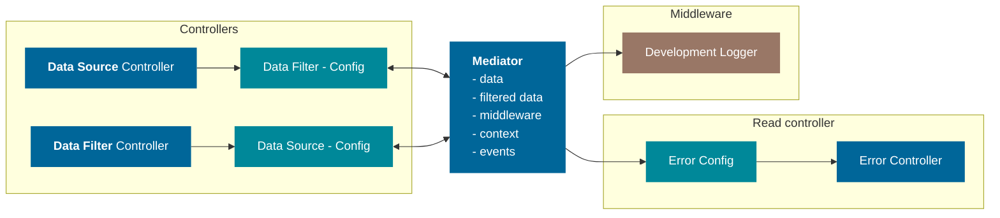
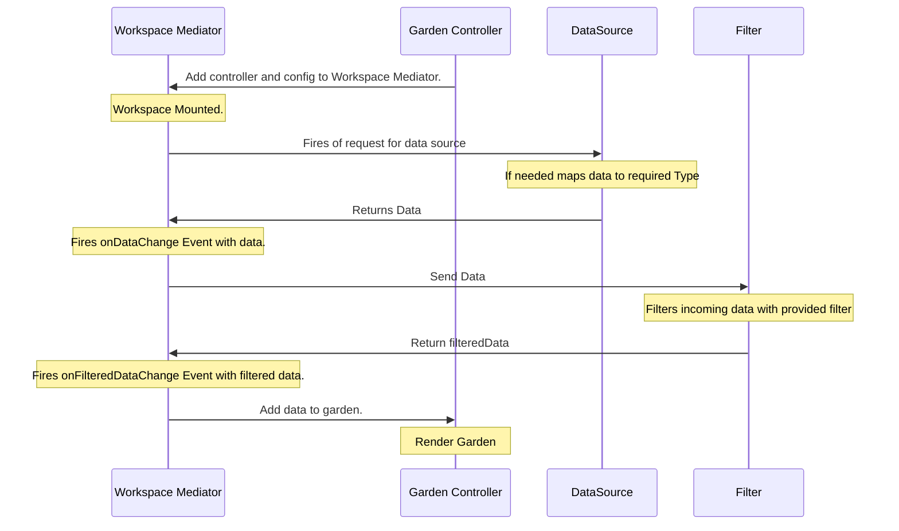

## Concept

A hub allowing for communication between controllers. Is is composed of smaller communication services. Each service handles only one thing and does it well. The core service in mediator is `dataService` more information can be found [here]("/services/#data-service").
services available in the `WorkspaceMediator` are:

- dataService
- clickService
- selectionService
- errorService
- bookmarkService
- urlService

::: warning Communication
The mediator should be the only communication device, and there should not be direct communications between controllers.
:::



## Middleware

To allow for complete flexibility an `AddMiddleware` function is added. This allows access to th e mediator. This should be used with caution.
The example below is a simple data logger connecting to the onDataChange event.

```TS
    mediator.AddMiddleware((mediator) => {
      mediator.onDataChange((data)=> {
        console.log("The current Data is: ", data)
      })
    })
```

## Services

### Observable

A Utility building blok for creating reactive services.

### Data Service

The `dataService` as the name implies, is in charge off data, it will consist of the original data and a filtered data set. Each of them triggers an corresponding event when data changes.



### Error Service

A workspace on its own will not have functionality for handling errors. The Error service allows you to manage errors and make the proper connection to a view component. By using the adding a subscriber to the workspace own `onError` event. This controller should serve as a parser for any errors occurring.

The `errorService` is in charge of centralizing all error in a workspace. It should have pan event for when errors occur and away of throwing errors.

- ThrowError
- onError

### Url Service

the `urlService` is in change of dispatching events when url changes and splitting ut query parameters.

::: info Query Parameters
the url service wil not handle any query parameters only dispatch events, the handling of query parameters will be done at a higher level.
:::

### Selection Service

`selectionService` as the name implies handles workspace selection and stores the selection for controller use.

### Click Service

This service is for handling workspace related clicks, mainly a helper service for the `selectionService`.
