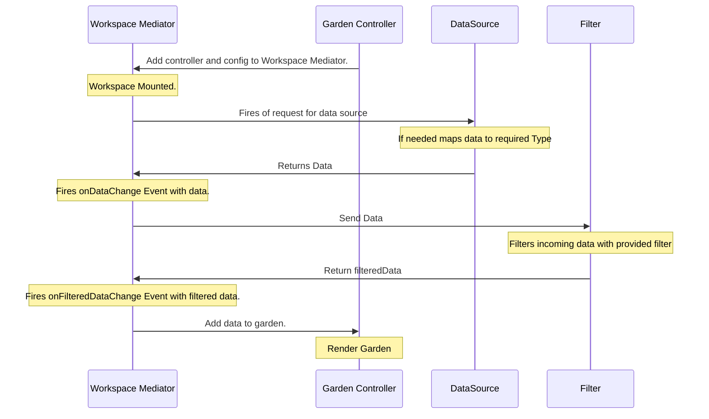

## Data Service

The `dataService` is one of the main buildingbloks of the `WorkspaceMediator` handling all the event data related. There are two data slots, `data` and `filteredData`.
Then data is set all callbacks registered on `onDataChange` will be called. to set data use the `setData` method. this is the same for `filteredData` with `setFilteredData` and `onFilterDataChange`.



::: info POC Code
The following code will be distributed over several files but this is the main concept.
:::

```TS
      const mediator = new WorkspaceMediator();
      const dataSourceController = new DataSourceController(); // External controller
      const filterController = new FilterController(); // External controller

      dataSourceController.data.onChange((data) => {
        mediator.dataService.setData(data);
      });
      dataSourceController.fetch();

      mediator.dataService.data$.subscribe((data) =>{
        filterController.setData(data);
        filterController.filter()
      });

      filterController.onFilteredDataChange((data)=> {
        mediator.filteredData = data
      })


```

## Error Service

The error service is a simple service for handling error occurring in a workspace. An error can be registered wilt the `onError` function. this will register a callback function that can be called. The triggering of errors is done with a function called `throwError`. This function will call all registered errors with the provided error object.

```TS
    const mediator = new WorkspaceMediator();

    mediator.errorService.error$.subscribe((error) => console.error(error))
    mediator.errorService.throwError("An error has occurred");
```

## Click Service

The `clickService` is responsible for capturing the click of one or more items in the workspace.

```TS

mediator.click({item: item})
mediator.click$.subscribe((ev) => console.log(ev))


export function applyWorkspaceClickToCells<TData, TError>(
    colDefs: ColDef<TData>[],
    { clickService }: FusionMediator<TData, TError>
) {
    return colDefs.map((colDef) => ({
        onCellClicked: (ev) => clickService.click({ item: ev.data }),
        ...colDef,
    }));
}

```

```TS
    mediator.clickService.click$.subscribe((ev) => {
        sc.setItem(ev.item);
        mediator.setIsSidesheetOpen(true);

    });
```

## Selection Service

The `selectionService` keeps track of the selected items. SelectedNodes is a list of strings containing the unique identifiers of each selection

When the selectedNodes attribute is updated the selectedNodes$ observable will emit a new value.

```TS
  mediator.clickService.onClick(({ item }) => {
      const id = getIdentifier(item);
      this.mediator.selectionService.selectedNodes = [id];
  );

```

## URL Service

The `urlService` main responsibility is to extract query parameters and notify `onUrlChanged`, callback registered. These callbacks will be provided with `Location` information.
the url in the Location object is base url, meaning all characters before `?` a query in `queryParams` items will be given as `itemId=1234` and so on.

```TS
  interface Location {
      queryParams: string[];
      url: string;
  }
```

## Bookmark Service

The `bookmarkService` allows you to capture controller states and consolidate the data. It also handle applying the state to the workspace, on example of usage is to persisted workspace settings to i.e. `indexDb` ,`localStorage` or `externalService`.

A controller when configured uses the `registerCapture` to register a function to capture a partial bookmark state. The `capture` function captures a bookmark using all the registered capturers. `onApply` event allows a controller so subscribe to setting that are being applied.

There is an example how its done using fusion garden.

```TS

      export function configureGardenBookmarkService<TData, TError, TCustomGroupByKeys, TCustomState, TContext>(
        gardenController: GardenController<TData, TCustomGroupByKeys, TCustomState, TContext>,
        mediator: FusionMediator<TData, TError>
      ) {

        mediator.bookmarkService.registerCapture(() => ({ garden: {
            groupingKeys: gardenController.grouping.value,
            selectedNodes: gardenController.selectedNodes.value,
        }}));

        mediator.bookmarkService.onApply((state) => {
            if(state?.garden) {
                gardenController.grouping.setValue(bookmark.groupingKeys);
                gardenController.selectedNodes.setValue(bookmark.selectedNodes);
            } });

        gardenController.grouping.onChange(mediator.bookmarkService.capture);
      }

```
