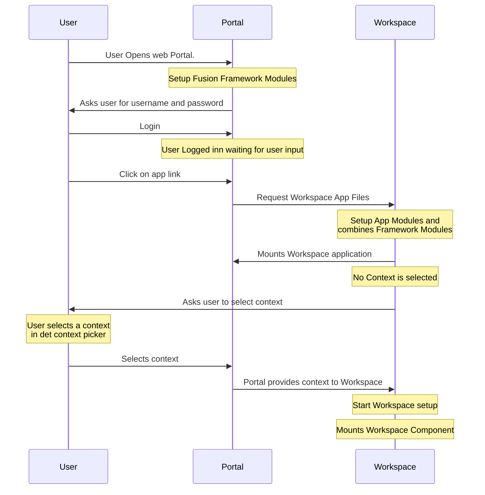

> A Fusion Workspace app is created easy. This is not a tutorial or incept explanation on how to create a fusion Workspace but a document explaining the concept of the Workspace apps. Mocked code examples will supply clarity.

## How it works

A workspace app is created using the `@equinor/fusion-workspace` and `@equinor/fusion-workspace-react` packages, and will provide all needed.

## Create Workspace App

To Create a fusion app its simple. the following code examples will describe the initial tough on how this should look.
The `createFusionWorkspaceApp` takes in a setup function, config and the `Fusion` object created by fusion and app module config.

> The `useFusionWorkspaceContext` will wrap `useFramework`, `useCurrentUser`and `useModuleContext` Hooks.

```TS
    export const useFusionWorkspaceContext = () => {
        const framework = useFramework();
        const modules = useModuleContext();
        const account = useCurrentUser();
        return {...framework, ...modules, ...account}
    }
```

`useFusionWorkspaceContext` will be used in the creation off a Workspace application as shown below, the following code snippet is the main setup of the workspace application.

```TS

const workspaceOptions: FusionWorkspaceOptions<IData> = {
    objectId: "id"
}

function workspaceSetup<IData>(ws: FusionWorkspaceFramework<IData>) {
            ws.configure(workspaceOptions)
            .addDataSource(() => ({
                dataSource: async (signal?: AbortSignal): Promise<Response> => {
                    const famClient = ws.fusion.httpClient("fam")
                    const { facilityId } = ws.fusion.context;
                    return await famClient.fetch(`api/${facilityId}/tags`);
                },
            })).addTableOptions(tableConfig)
            .addGardenOptions(gardenConfig)
            .addStatusItems(statusBarConfig)
            .addFilterOptions(filterConfig)
};


export const WorkspaceAppComponent = () => {
    const fusion = useFusionWorkspaceContext()
    const Workspace = useMemo(() => createFusionWorkspaceApp<IData>(workspaceSetup, fusion),[framework.context.contextId]);

    return (
        <>
            { framework.context.contextId ? <Workspace /> :  <ContextSelector/> }
        </>
    );
};
```

The `WorkspaceAppComponent` is the used in the `createApp` bootstrapping everything with component modules and fusion framework.

```TS
import iModule, { IModule } from '@equinor/fusion-IModule';
import createWorkspaceApp { AppConfigurator } from '@equinor/fusion-workspace';
import { WorkspaceAppComponent } from "./WorkspaceAppComponent"

const configCallback: AppConfigurator<[IModule]> = async (appModuleConfig, frameworkApi) => {
    await frameworkApi.modules.serviceDiscovery.configureClient('fam', appModuleConfig);
};


export const configurator = createApp(WorkspaceAppComponent, configCallback, [moduleAgrGrid]);

export const App = () => {
    const framework = useFramework();
    const Component = configurator(framework, {});
    return (
        <Suspense fallback={<StarProgress text="Loading Application" />}>
            <Component />
        </Suspense>
    );
};

export default App;
```

## App mounding Loading sequence

Diagram showing the lodging sequents of a workspace app, built on the Fusion App loading sequence.


