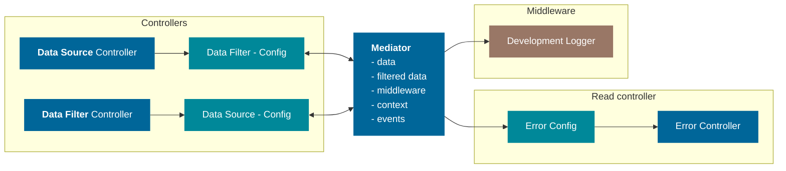

## Concept

Workspace core should b a library independent and it's main role is to allow various part of a workspace to communicate. This trough a common hub. The Core library will be written in pure Typescript.

## Mediator

A hub allowing for communication between controllers. it should be composed of smaller components to keep things clean. These components will be called services.
main services will be `dataService` and `errorService`

::: warning Communication
The mediator should be the only communication device, and there should not be direct communications between controllers.
:::

