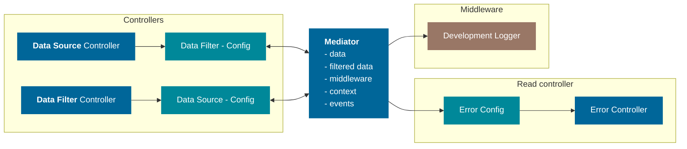
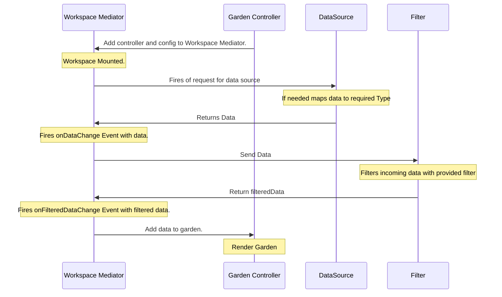

## Concept

Workspace core should b a library independent and it's main role is to allow various part of a workspace to communicate. This trough a common hub. The Core library will be written in pure Typescript.

## Mediator

A hub allowing for communication between controllers. it should be composed of smaller components to keep things clean. These components will be called services.
main services will be `dataService` and `errorService`

::: warning Communication
The mediator should be the only communication device, and there should not be direct communications between controllers.
:::

## Services

### Observable

A Utility building blok for creating reactive services.

### Data Service

The `dataService` as the name implies, is in charge off data, it will consist of the original data and a filtered data set. Each of them triggers an corresponding event when data changes.

### Error Service

The `errorService` is in charge of centralizing all error in a workspace. It should have pan event for when errors occur and away of throwing errors.

### Url Service

the `urlService` is in change of dispatching events when url changes and splitting ut query parameters.

::: info Query Parameters
the url service wil not handle any query parameters only dispatch events, the handling of query parameters will be done at a higher level.
:::

### Selection Service

`selectionService` as the name implies handles workspace selection and stores the selection for controller use.

### Click Service

This service is for handling workspace related clicks, mainly a helper service for the `selectionService`.
