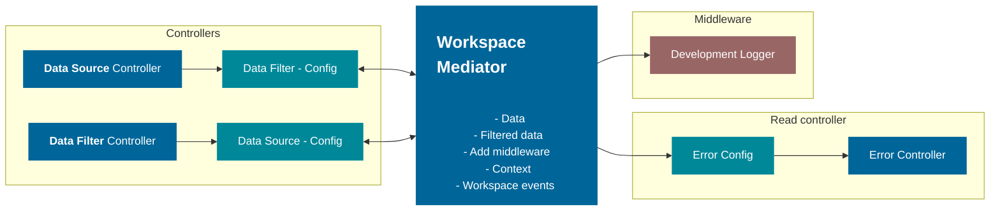

# Workspace Core

[](https://npmjs.org/package/@equinor/workspace-core)
[](https://npmjs.org/package/@equinor/workspace-core)
[](https://github.com/equinor/fusion-workspace/blob/master/package.json)
[](https://npmjs.org/package/@equinor/workspace-core)

- [Workspace Core](#workspace-core)
  - [Install from NPM](#install-from-npm)
  - [Workspace Mediator](#workspace-mediator)
  - [Core Component](#core-component)
    - [Data](#data)
    - [Middleware](#middleware)
    - [Context](#context)
    - [Click and onClick](#click-and-onclick)
    - [Error](#error)
  - [Building](#building)
  - [Running unit tests](#running-unit-tests)

[<< Project Readme](/README.md)

## Install from NPM

```sh-session
npm install @equinor/workspace-core --save
```

## Workspace Mediator

The workspace mediator is a common hub for all workspace related controllers, written following the mediator pattern. It helps interaction between independent controllers. The idea is for the mediator to be pure JS/TS and not be dependent on any JS framework. Mediator is not intended for standalone use. By extending the mediator it is possible to add library specific features. This is done to keep the core library as clean as possible.

```TS
  import { WorkspaceMediator } from "@equinor/workspace-core"
  class ReactWorkspaceMediator extends WorkspaceMediator{
    constructor() {
      super()
    }

    // React Workspace Mediator implementations
  };
```

Under the intended use of the mediator is shown in fig.1 The two controllers an communicating trough the mediator updating the data fields.



> Figure 1. Workspace mediator connections for Fusion Workspace Framework

## Core Component

The mediator's core component is a simple Observable class allowing for pub sub. This is for easy reactive integrations. The example below is how the class is used in the library.

```TS
  import { WorkspaceMediator } from "@equinor/workspace-core"
  class WorkspaceMediator<TData>{

    onDataChange: (callback: OnchangeCallback<TData[]>) => () => void;
    data: TData[] | undefined;
    setData: (value: TData[]) => void;

    constructor() {
      const data = new Observable<TData[]>();
      this.onDataChange = data.onchange;
      data.onchange((val) => {
        this.data = val;
      });
      this.setData = data.setValue;
    }

    //  More Implementations
  };
```

### Data

A workspace i driven by data, It has a `data` and `filteredData` field. to set these use the corresponding `setData` and `setFilteredData` functions. When data has changed all callback registered onto the `onDataChanged` event is triggered. Same thing goes for `onFilteredDataChanged`.

```TS
export function addDataSource<TData>(
    dataFetchConfig: DataFetchAsyncConfig<TData>,
    mediator: WorkspaceReactMediator<TData>
) {
    const controller = new DataSourceController(dataFetchConfig);

    controller.data.onchange((data) => {
        mediator.setData(data);
    });
  
    controller.fetch();
}

```

### Middleware

 By having the whole workspace mediator at your disposal, middleware allows you to hook on to the mediators events and add custom actions.

```TS
function logger(wm) => {
        wm.onDataChanged(data) => {
          console.log(data);
        });
    };

workspaceMediator.addMiddleware(logger);
```

This will do the same as when you registered the mediator but middleware allows for extreme flexibility

### Context

Reserved slot for the developer(you) to define and utilize. Most common use for it is to share data from one mediator to another. Through context and middleware but can be used passed data inn to the context.

setContext

```TS
workspaceMediator.setContext((currentContext)=> ({
  ...currentContext,
  person: {
    name: "Tom",
    lastName: "Jones"
    age: 82
  }
}));

```

### Click and onClick

To be abel to trigger events by `click`, this will trigger the `onClick`
event on the workspace mediator.

### Error

- onError
- throwError
  
This library was generated with [Nx](https://nx.dev).

## Building

Run `nx build workspace-core` to build the library.

## Running unit tests

Run `nx test workspace-core` to execute the unit tests via [Jest](https://jestjs.io).
