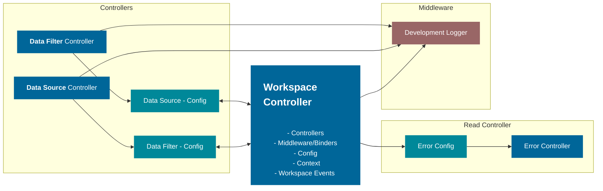

# Workspace Core

[](https://npmjs.org/package/@equinor/workspace-core)
[](https://npmjs.org/package/@equinor/workspace-core)
[](https://github.com/equinor/fusion-workspace/blob/master/package.json)
[](https://npmjs.org/package/@equinor/workspace-core)

-   [Workspace Core](#workspace-core)
    -   [Install from NPM](#install-from-npm)
    -   [Workspace Controller](#workspace-controller)
        -   [Controllers](#controllers)
        -   [Middleware](#middleware)
        -   [Data](#data)
        -   [Context](#context)
        -   [Click and onClick](#click-and-onclick)
        -   [Error](#error)
    -   [Building](#building)
    -   [Running unit tests](#running-unit-tests)

[<< Project Readme](/README.md)

## Install from NPM

```sh-session
npm install @equinor/workspace-core --save
```

## Workspace Controller

```TS
import { createWorkspaceController } from "@equinor/workspace-core"
const workspaceController = createWorkspaceController();
```

The workspace controller is a common hub for all controllers. The idea is for the workspace controller to be pure JS/TS and not be dependent on any JS framework. The Workspace controller will consist of the followings sections.

### Controllers

A collection of building blocks allows the creation of a workspace. And the building blocks themselves are interchangeable and will be customized toward the workspaces needs. `Controllers` are the actuators of the workspace; nothing happens without a controller. The goal is to create many small and specific controllers that do one thing well. To add a controller use the `addController` function on the workspace controller.

```TS

const controller = {
    name: 'dataSource',
    controller: dataSourceController,
    config: (dc, ws) => {
        dc.onDataChanged(data) => {
          wc.setData(data);
        });
    },
};

const workspaceController = createWorkspaceController();

workspaceController.addController(controller)

```

### Middleware

Controllers are supposed to be 100% decoupled from each other. Middleware is the translator that connects one or multiple controllers. When adding a controller a sort of middleware can be added to the `config` as shown above. This ensures that all controllers can be used standalone and ensures high flexibility with low complexity. The `addMiddleware` function allows you to do the same as the config but you only get supplied the workspace controller.

```TS
function myDataSourceMiddleware( ws) => {
        ws.controller.dataSource.onDataChanged(data) => {
          wc.setData(data);
        });
    };

workspaceController.addMiddleware(myDataSourceMiddleware);
```

This will do the same as when you registered the controller but middleware allows for extreme flexibility, having the whole workspace at your disposal.

### Data

A workspace i driven by data has a `data` and `filteredData` field. to sett these use the corresponding `setData`and `setFilteredData` functions. When data is has changed all callback registered ont the `onDataChanged` event is triggered. Same thing goes for `onFilteredDataChanged`.

### Context

Reserved slot for the developer(you) to define and utilize. Most common use for it is to share data from one controller to another. Through context and middleware but can be used passed data inn to the context.

setContext

```TS
workspaceController.setContext((currentContext)=> ({
  ...currentContext,
  person: {
    name: "Tom",
    lastName: "Jones"
    age: 82
  }
}));

```

### Click and onClick

To be abel to trigger events by `click`, this will trigger the `onClick`
event on the workspace controller.

```TS

workspaceController.addController({
    name: 'dataSource',
    controller: dataSourceController,
    config: (dc, ws) => {
        dc.onDataChanged((data) => {
          wc.setData(data);
        });
        wc.onClick((e, ws) => {
          if (e.type === "updateData") {
            ws.setData(e.data);
          }
        });
    },
});

workspaceController.click({
  type: "updateData",
  data: [
    // some data...
  ]
});

```

### Error

The workspace controller consists of the "Core" events that most controllers will depend on in some form. Core Workspace events are the following.

-   onError

Core Functions:

-   throwError

Controllers and middleware usually bind through workspace controller events. Alternatively, you can extend the workspace controller with common data fields through the controller's context property.

Here is an diagram of use se figure1:



> Figure 1. Workspace Controller connections for Fusion Workspace Framework

This library was generated with [Nx](https://nx.dev).

## Building

Run `nx build workspace-core` to build the library.

## Running unit tests

Run `nx test workspace-core` to execute the unit tests via [Jest](https://jestjs.io).
