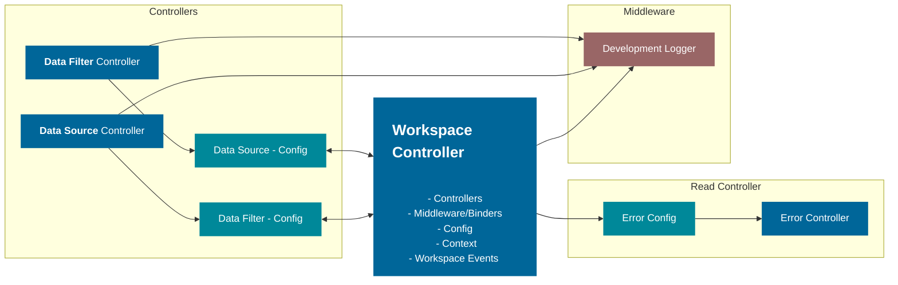

# workspace-core

This library was generated with [Nx](https://nx.dev).

## Building

Run `nx build workspace-core` to build the library.

## Running unit tests

Run `nx test workspace-core` to execute the unit tests via [Jest](https://jestjs.io).

## Workspace Controller

The workspace controller is a common hub for all controllers. The idea is for the workspace controller to be pure JS/TS and not be dependent on any JS framework. The Workspace controller will consist of the following.

- Controllers
  - Controller
  - Config
  - Name
- Middleware/Binders
  - Config
- Context (Not to be confused with fusion context)
- Workspace Events
- Source Data
- Filtered Data
- Persist

Here is an example of use se figure1:

> Figure 1. Workspace Controller connections for Fusion Workspace Framework 

### Controllers

A collection of building blocks allows the creation of a workspace. And the building blocks themselves are interchangeable and will be customized toward the workspaces needs. `Controllers` are the actuators of the workspace; nothing happens without a controller. The goal is to create many small and specific controllers that do one thing well. `Middleware` will enable binding them together and unlocking endless possibilities.

### Middleware/Binders

Controllers are supposed to be 100% decoupled from each other. Binders/middleware is the translator that connects one or multiple controllers. This ensures that all controllers can be used standalone and ensures high flexibility with low complexity.

### Context

Reserved slot for the developer(you) to define and utilize. Most common use for it is to share data from one controller to another. Through context and middleware/binders.

### Workspace Events and functions

The workspace controller consists of the "Core" events that most controllers will depend on in some form. Core Workspace events are the following.

- onError
- onDataChange
- onFilterDataChange
- onClick

Core Functions:

- setData
- setFilteredData
- throwError
- addController
- addMiddleware

Controllers and middleware usually bind through workspace controller events. Alternatively, you can extend the workspace controller with common data fields through the controller's context property.

