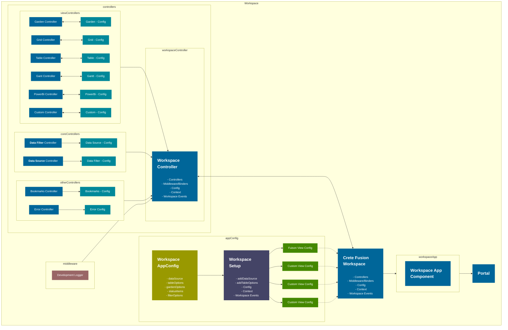

[<< BACK](/README.md)

```mermaid
flowchart LR
    classDef default fill:#0000,stroke:#333,stroke-width:4px,stroke-dasharray: 5 5,text-align:left,color:#fff;

    classDef framework fill:#006699,stroke:none,text-align:left;
    classDef app fill:#006699,stroke:none,text-align:left;
    classDef portal fill:#006699,stroke:none,text-align:center;
    classDef appConfig fill:#999900,stroke:none,text-align:left;
    classDef setup fill:#444466,stroke:none,text-align:left;


    classDef controller fill:#006699,stroke:none,text-align:left;
    classDef config fill:#008899,stroke:none
    classDef viewConfig fill:#448800,stroke:none
    classDef middleware fill:#996666,stroke:none


    subgraph Workspace
        direction LR

        portal[<h2>Portal</h2>]:::portal

        workspaceAppConfig[<h2>Workspace AppConfig </h2><span><br> - dataSource <br> - tableOptions <br> - gardenOptions <br> - statusItems<br>- filterOptions </span>]:::appConfig

        workspaceSetup[<h2>Workspace Setup</h2><span><br> - addDataSource <br> - addTableOptions <br> - Config <br> - Context<br>- Workspace Events </span>]:::setup

        createFusionWorkspace[<h2>Crete Fusion Workspace </h2><span><br> - Controllers <br> - Middleware/Binders <br> - Config <br> - Context<br>- Workspace Events </span>]:::controller

        wc[<h2>Workspace Controller</h2><span><br> - Controllers <br> - Middleware/Binders <br> - Config <br> - Context<br>- Workspace Events </span>]:::controller

        wcDataSource[<b>Data Source</b> Controller]:::controller
        wcFilter[<b>Data Filter</b> Controller]:::controller
        wcBookmarks[Bookmarks Controller]:::controller

        wcFilterConfig[Data Source - Config]:::config
        wcDataSourceConfig[Data Filter - Config]:::config
        wcBookmarksConfig[Bookmarks - Config]:::config


        gardenController[Garden Controller]:::controller
        gridController[Grid Controller]:::controller
        tableController[Table Controller]:::controller
        ganttController[Gant Controller]:::controller
        pbiController[PowerBi Controller]:::controller
        customController[Custom Controller]:::controller

        gardenConfig[Garden - Config]:::config
        gridConfig[Grid - Config]:::config
        tableConfig[Table - Config]:::config
        ganttConfig[Gantt - Config]:::config
        pbiConfig[PowerBi - Config]:::config
        customConfig[Custom - Config]:::config


        fusionViewConfig[Fuison View Config]:::viewConfig
        customViewConfig[Custom View Config]:::viewConfig
        filterConfig[Custom View Config]:::viewConfig
        dataConfig[Custom View Config]:::viewConfig

        wcErrorConfig[Error Config]:::config
        wcError[Error Controller]:::controller


        subgraph controllers
            direction TB


            subgraph viewControllers
                direction LR
                gardenController <--> gardenConfig
                gridController <--> gridConfig
                tableController <--> tableConfig
                ganttController <--> ganttConfig
                pbiController <--> pbiConfig
                customController <--> customConfig
            end

            subgraph workspaceController
                direction LR
            wc

            end

            subgraph coreControllers
                direction LR
                wcFilter --> wcFilterConfig
                wcDataSource --> wcDataSourceConfig
            end

            subgraph otherControllers
                direction LR
                wcBookmarks --> wcBookmarksConfig
                wcError-->wcErrorConfig
            end

                viewControllers --> wc
                coreControllers --> wc
                otherControllers --> wc
        end

        subgraph appConfig
            direction LR
            workspaceAppConfig --> workspaceSetup
            workspaceSetup --> fusionViewConfig
            workspaceSetup --> customViewConfig
            workspaceSetup --> filterConfig
            workspaceSetup --> dataConfig

        end

        subgraph workspaceApp
            direction LR
            appComponent[<h2>Workspace App Component</h2>]:::app
        end

        createFusionWorkspace --> workspaceApp

        wc <----> createFusionWorkspace


        subgraph middleware
            wcLoggerMiddleware[Development Logger]:::middleware
        end

        middleware --> wc


        fusionViewConfig -.-> createFusionWorkspace
        filterConfig -.-> createFusionWorkspace
        dataConfig -.-> createFusionWorkspace
        customViewConfig -.-> createFusionWorkspace

        workspaceApp --> portal

    end

```
