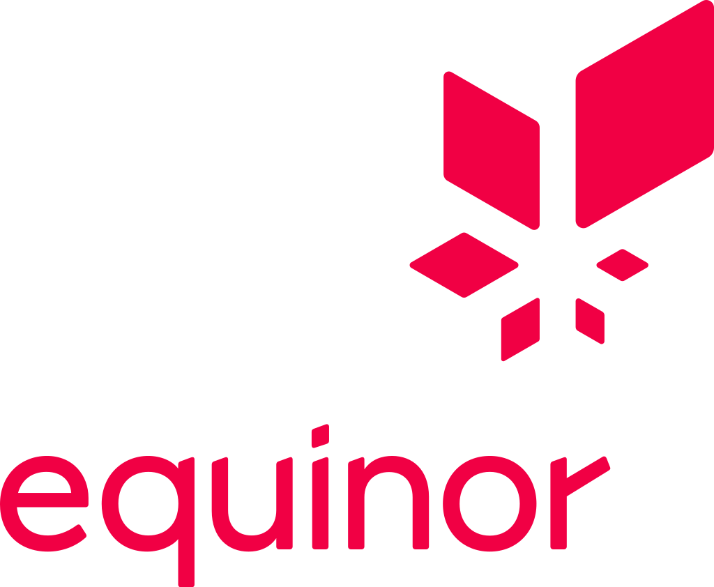

# Fusion Workspace v1.0.0

( Fusion Workspace v1.0.0 - CC workspace v2.0 )

## Pre work and speck

-   [x] Workspace Workshop (Done)
-   [x] Workspace Controller - v0.1
-   [x] WorkspaceProjectFeatureList - v0.1
-   [x] WorkspaceReactWrapper - v0.1
-   [x] FusionWorkspaceApp - v0.1

> This is a speck document for the `Fusion Project Portal 1.0.0v` based on proof-of-concept `Johan Castberg Portal`. This is just an assumption of a hi level scope for the project to come, only to verify the initial thoughts.

The work required to scale can be split into three parts. Work related to the workspace and the components it relies on, the Project Portal, and the conversion of `Castberg` apps to be fusion powered and ready for scale.

These document will focus on the workspace section of the pre-work.

## Content

| Core Pages                                                  | Description                                                                                                     |
| ----------------------------------------------------------- | --------------------------------------------------------------------------------------------------------------- |
| [Workspace Controller](./WorkspaceController.md)            | Core component in a workspace, a pure JS library.                                                               |
| [Workspace React Wrapper](./WorkspaceReactWrapper.md)       | Wrapper for the Workspace Controller                                                                            |
| [Fusion Workspace Framework](./FusionWorkspaceFramework.md) | A simplified way to create a workspace Bootstrapped with view components utilizing the Workspace React Wrapper. |
| [Fusion Workspace App](./FusionWorkspaceApp.md)             | How a app is created.                                                                                           |
| **Other Pages**                                             |

[Workspace Specification / Feature List](./WorkspaceProjectFeatureList.md)
