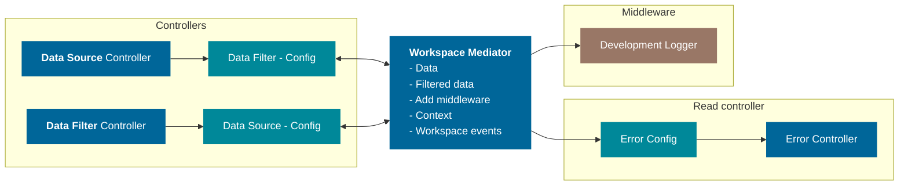

<ModuleBadge module="workspace-core" />

## Concept

The workspace mediator is a common hub for all workspace related controllers, written following the mediator pattern. It helps interaction between independent controllers. The idea is for the mediator to be pure JS/TS and not be dependent on any JS framework. Mediator is not intended for standalone use. By extending the mediator it is possible to add library specific features. This is done to keep the core library as clean as possible.

::: tip test
test
:::

The intended use of the mediator is shown in fig.1 The two controllers and communicating through the mediator updating the data fields.

::: warning test
test
:::



## Example

```TS
  import { WorkspaceMediator } from "@equinor/workspace-core"
  class ReactWorkspaceMediator extends WorkspaceMediator{
    constructor() {
      super()
    }

    // React Workspace Mediator implementations
  };
```
